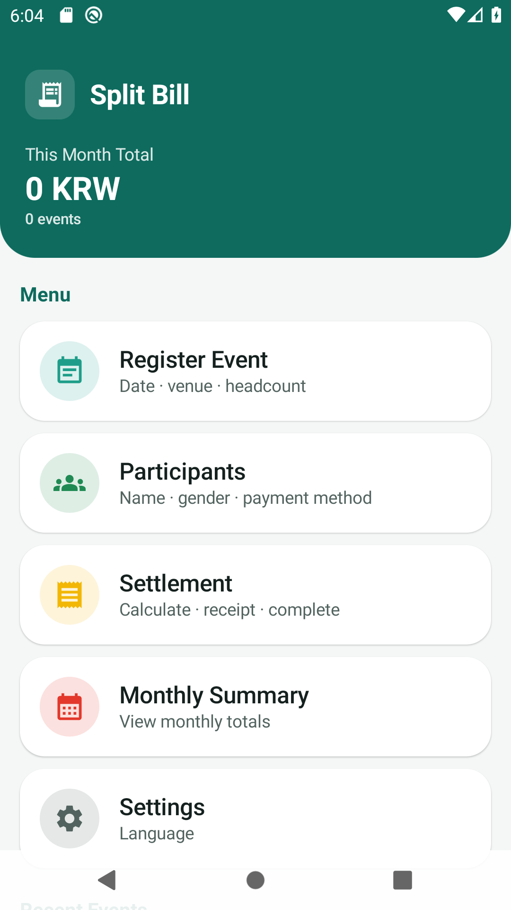
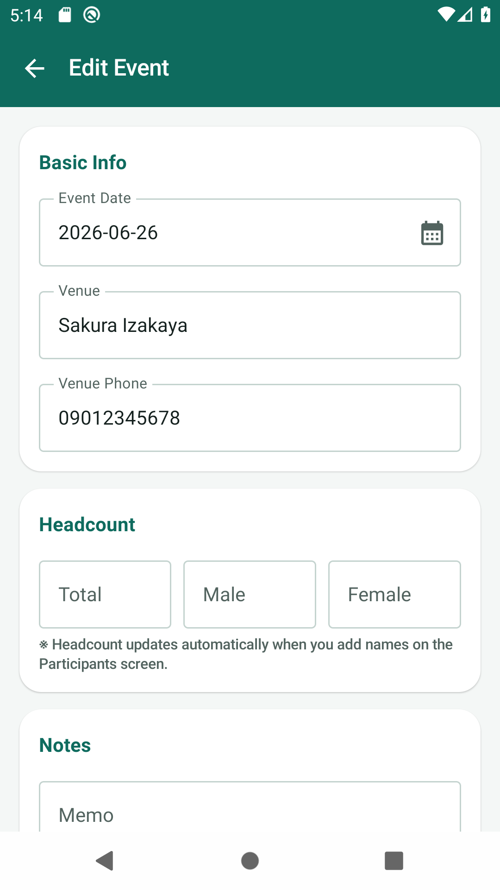
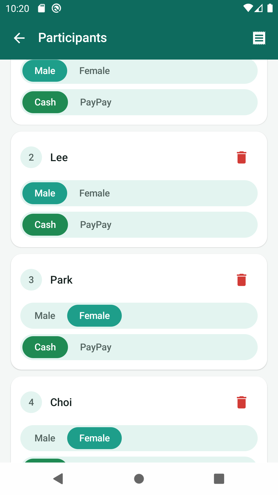
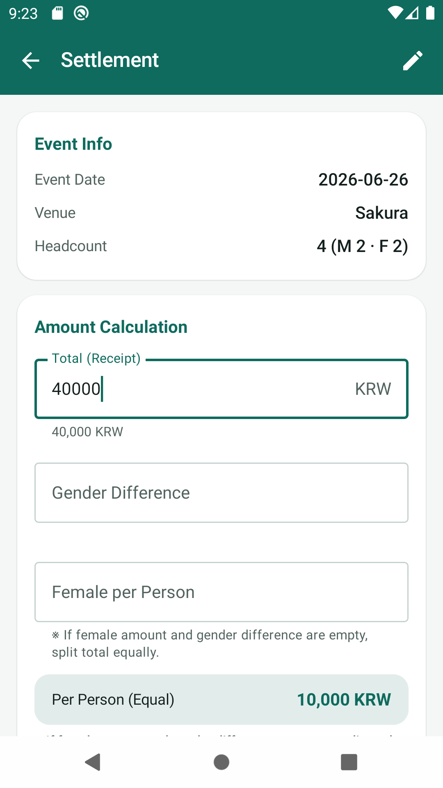
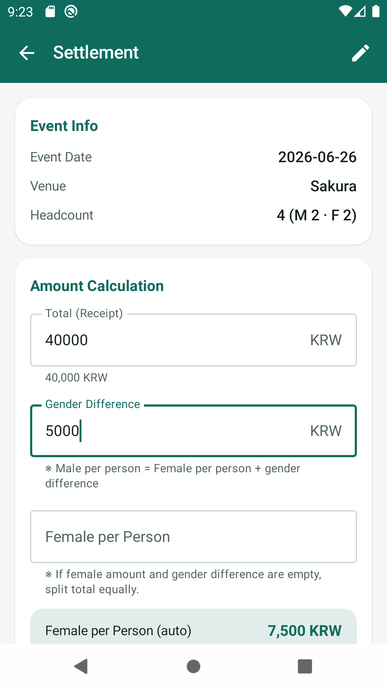
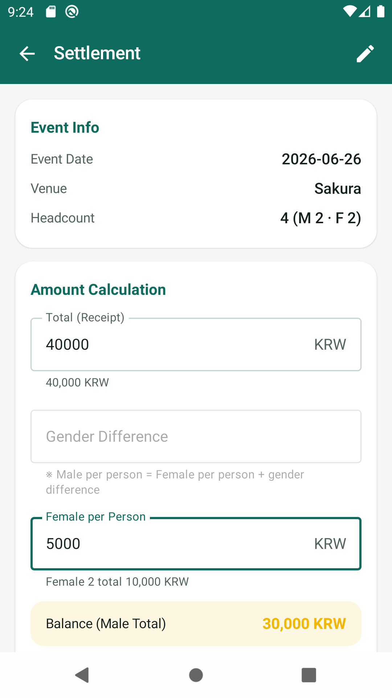
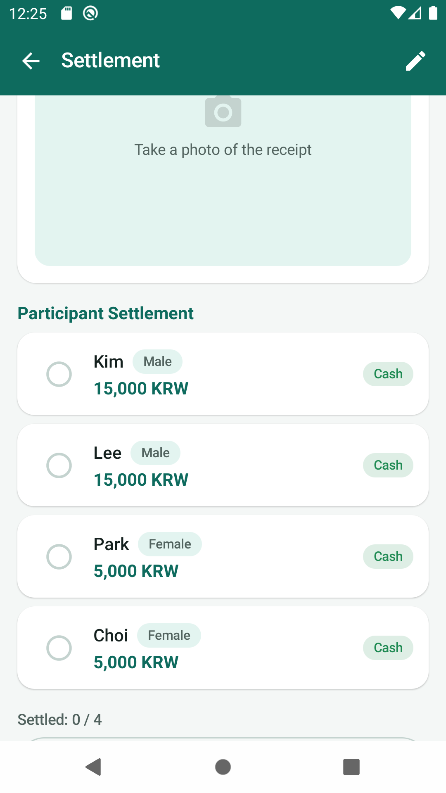
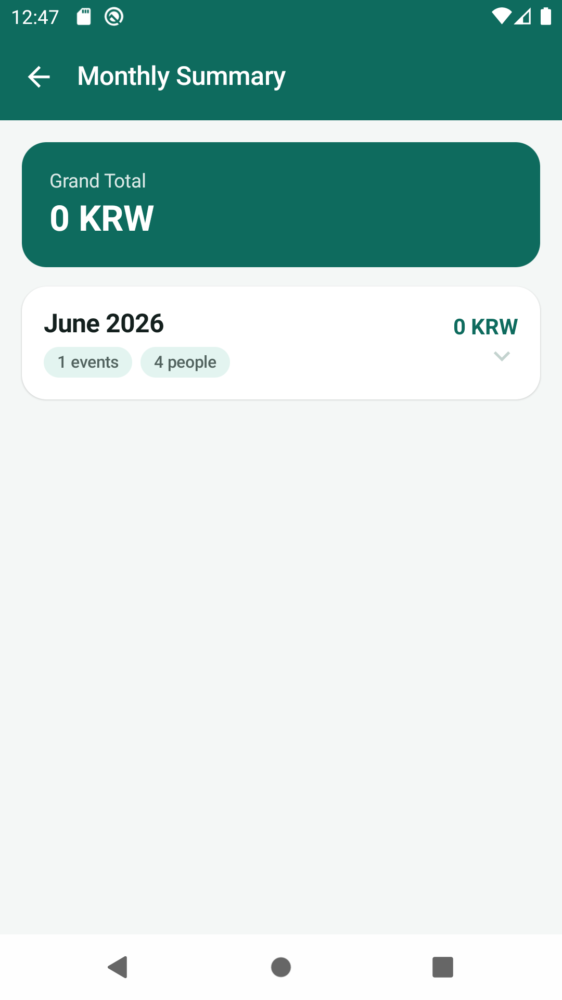
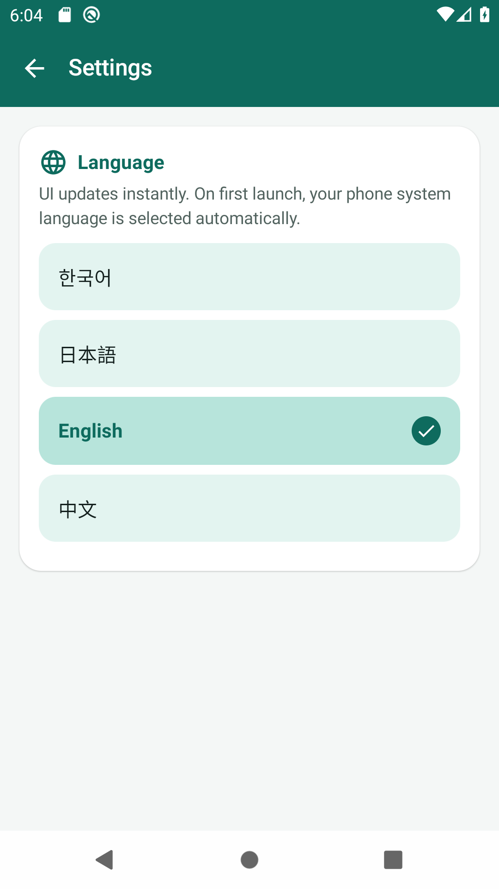

# Split Bill User Manual (English)

> On first launch, the app matches your **phone system language**. You can choose **한국어 / 日本語 / English / 中文** in Settings.

📖 Other languages: [한국어](MANUAL_ko.md) · [日本語](MANUAL_ja.md) · [中文](MANUAL_zh.md)

---

## Contents
1. [Home](#1-home)
2. [Register Event](#2-register-event)
3. [Participants](#3-participants)
4. [Settlement](#4-settlement)
5. [Monthly Summary](#5-monthly-summary)
6. [Settings](#6-settings)

---

## 1. Home

---

## 2. Register Event

---

## 3. Participants

---

## 4. Settlement

**Equal split** — no female amount or gender difference

> 40,000 KRW, 4 people → **10,000 KRW each**

**Gender difference** — male pays female amount + difference

> 40,000 KRW, difference 5,000, M2 · F2 → **F 7,500 / M 12,500**

**Female per person** — gender difference reset to 0

> 40,000 KRW, female 5,000 each, M2 · F2 → **male balance 30,000 KRW**

**Reset · Complete**

---

## 5. Monthly Summary

---

## 6. Settings

Follows system language until you pick manually. App name: **Split Bill**

