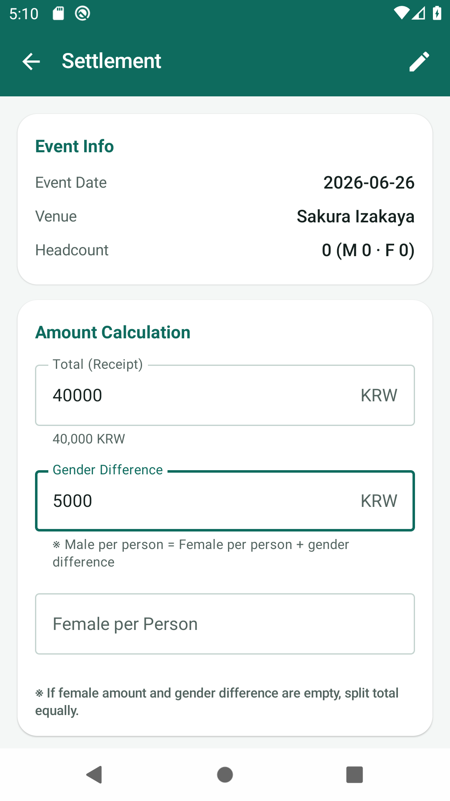

# 精算アプリ 取扱説明書 (日本語)

> 初回起動時は**端末のシステム言語**が自動選択されます。設定で **한국어 / 日本語 / English / 中文** を選べます。

📖 他言語: [한국어](MANUAL_ko.md) · [English](MANUAL_en.md) · [中文](MANUAL_zh.md)

---

## 目次
1. [ホーム画面](#1-ホーム画面)
2. [集まり情報登録](#2-集まり情報登録)
3. [参加者登録](#3-参加者登録)
4. [精算](#4-精算)
5. [月別精算一覧](#5-月別精算一覧)
6. [設定](#6-設定)

---

## 1. ホーム画面

---

## 2. 集まり情報登録

---

## 3. 参加者登録

---

## 4. 精算

**均等割り** — 女性・男女差額未入力

**男女差額入力** — 男性 = 女性 + 差額

**女性金額入力** — 男女差額は0にリセット

**精算リセット · 完了**

---

## 5. 月別精算一覧

---

## 6. 設定

システム言語に連動。アプリ名: **精算アプリ**

