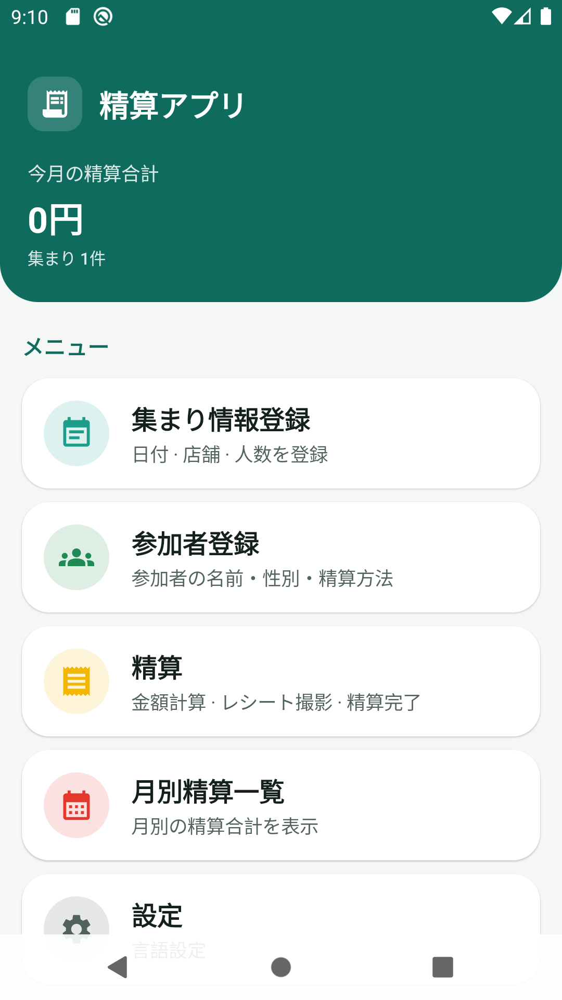
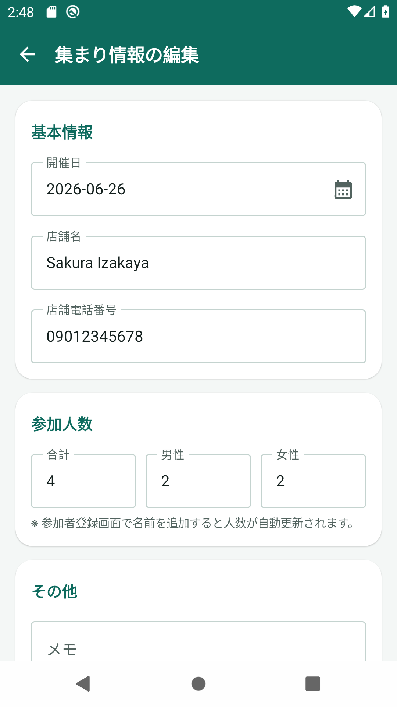
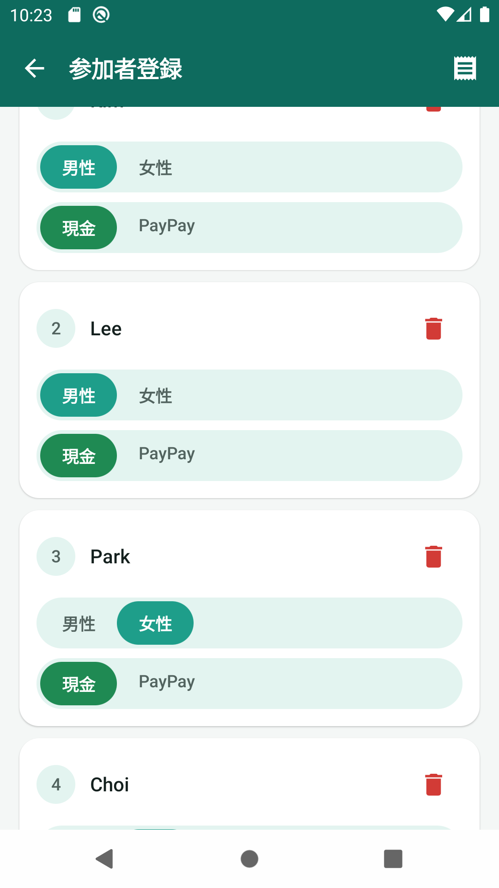
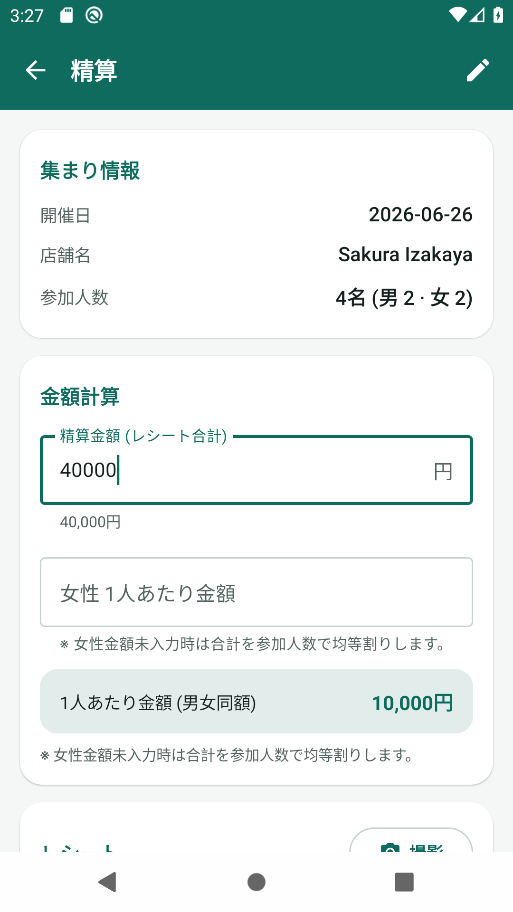
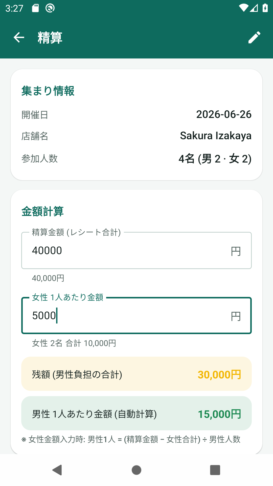
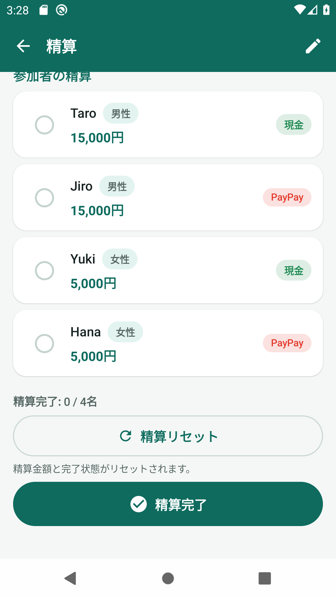
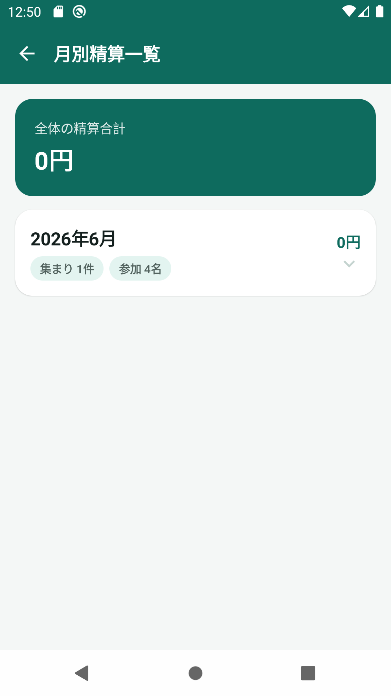
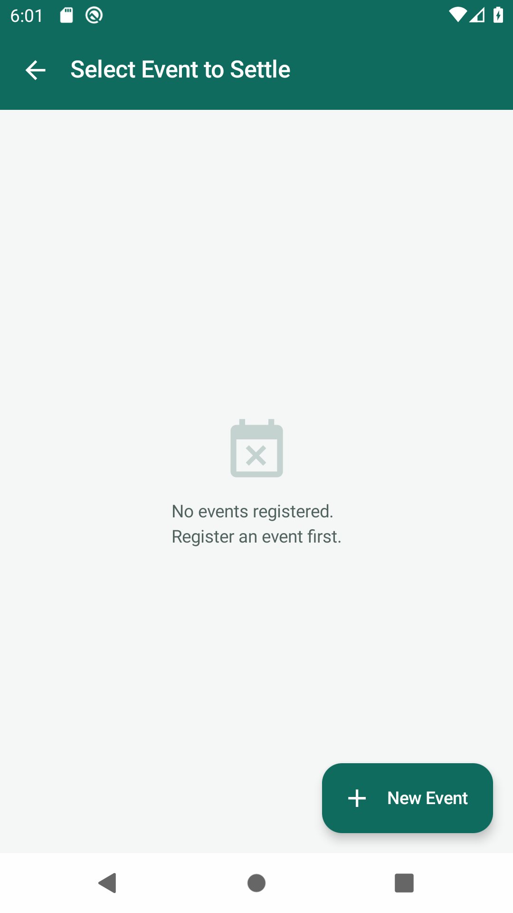

# 精算アプリ 取扱説明書 (日本語)

> 集まりの会費・割り勘を手軽に管理できる Android アプリです。
> 言語設定で **한국어 / 日本語** を選ぶと、メニューと全画面が即座に切り替わります。

🇰🇷 한국어 매뉴얼은 [MANUAL_ko.md](MANUAL_ko.md) を参照してください。

---

## 目次
1. [ホーム画面 (メニュー)](#1-ホーム画面-メニュー)
2. [集まり情報登録](#2-集まり情報登録)
3. [参加者登録](#3-参加者登録)
4. [精算 (金額計算・レシート・精算完了)](#4-精算)
5. [月別精算一覧](#5-月別精算一覧)
6. [設定 (言語変更)](#6-設定-言語変更)

---

## 1. ホーム画面 (メニュー)

アプリを起動すると最初に表示される画面です。
- 上部に **今月の精算合計** と集まり件数が表示されます。
- 5つのメニューカード: 集まり情報登録・参加者登録・精算・月別精算一覧・設定
- 下部に **最近の集まり** が表示され、カードをタップすると精算画面へ、「編集」で集まり情報を編集できます。

---

## 2. 集まり情報登録

集まりの基本情報を登録します。
- **開催日**: カレンダーアイコンをタップして日付を選択
- **店舗名 / 店舗電話番号** を入力
- **参加人数(合計・男性・女性)**: 直接入力するか、参加者登録画面で名前を追加すると自動更新されます。
- **その他(メモ)** を入力
- 下部の **「登録して参加者を追加」** ボタンで保存し、参加者登録画面へ移動します。

---

## 3. 参加者登録

選択した集まりの参加者を登録します。(最大 **30名**)
- 上部に集まり情報(開催日・店舗名・登録人数)が表示されます。
- **名前** を入力し、**性別(男性/女性)**、**精算方法(現金/PayPay)** を選んで **「追加」** をタップします。
- 登録した参加者は下の **参加者リスト** に表示され、性別・精算方法の変更や削除ができます。

---

## 4. 精算

レシート金額を入力すると、参加者ごとの精算金額が自動計算されます。

### 金額計算ルール

**基本 (女性金額未入力)** — 男女同額で均等割り

| 項目 | 計算式 |
| --- | --- |
| 1人あたり金額 (男女同額) | 精算金額 ÷ 参加人数 |

> 例) 精算金額 40,000円、参加4名(男2・女2)、女性金額未入力 → **1人 10,000円**

**女性金額入力時** — 女性合計を引いた残りを男性人数で割ります

| 項目 | 計算式 |
| --- | --- |
| 女性合計 | 女性1人あたり金額 × 女性人数 |
| 残額 | 精算金額 − 女性合計 |
| 男性1人あたり金額 | 残額 ÷ 男性人数 |

> 例) 精算金額 40,000円、女性1人 5,000円、男2・女2 → 女性合計 10,000円、**男性1人 15,000円**

### レシート撮影 · 参加者の精算 · リセット
- **レシート**: 「撮影」ボタンでカメラを起動し、レシート写真を保存します。
- 参加者ごとに金額と精算方法が表示され、精算済みの人は左の丸をタップしてチェックします。
- **「精算リセット」** ボタンで入力金額と精算完了チェックを初期化できます (レシート写真は保持)。
- 最後に **「精算完了」** ボタンをタップして保存します。

---

## 5. 月別精算一覧

月ごとの精算合計を一目で確認できます。
- 上部に **全体の精算合計** が表示されます。
- 月のカードをタップするとその月の集まり一覧が開き、集まりをタップすると精算画面へ移動します。

---

## 6. 設定 (言語変更)

- **言語設定** で **한국어** または **日本語** を選択します。
- 選択した瞬間にメニューと全画面の言語が変わり、設定はアプリを再起動しても保持されます。

