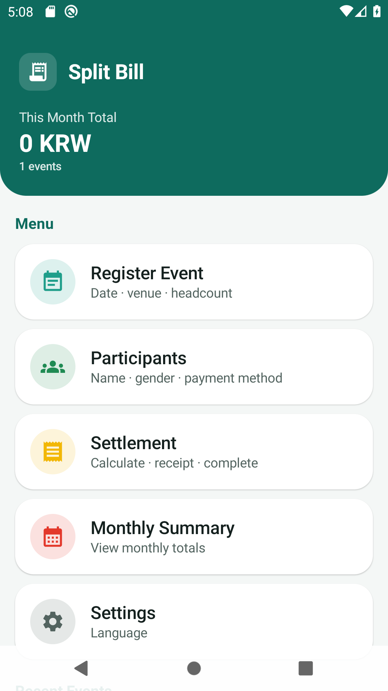
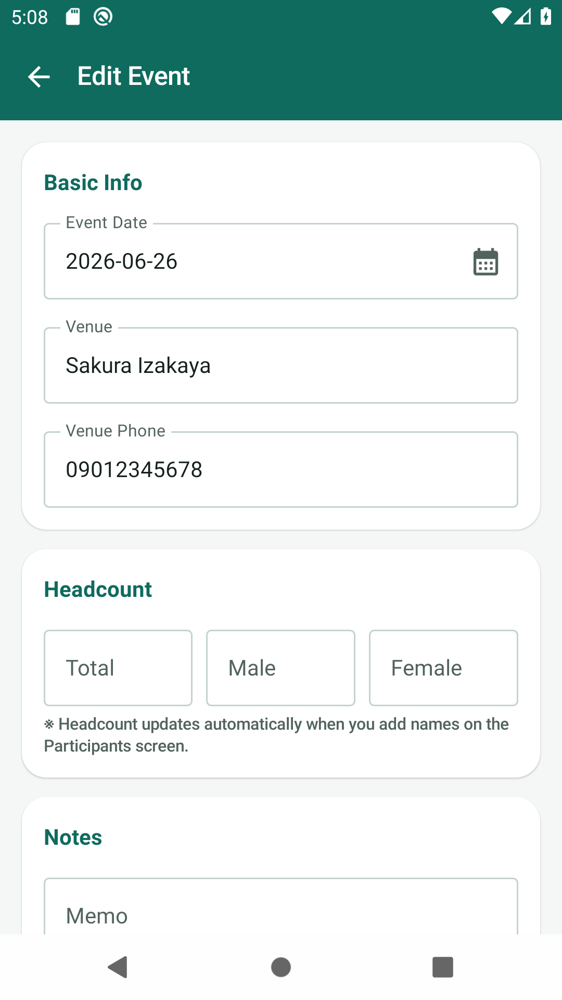
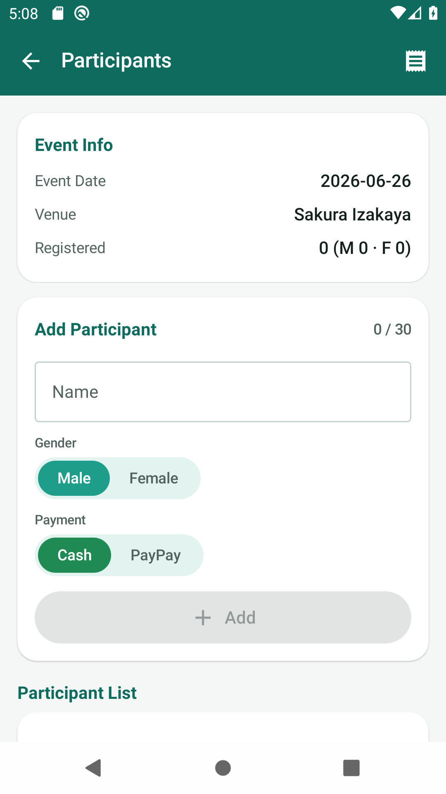
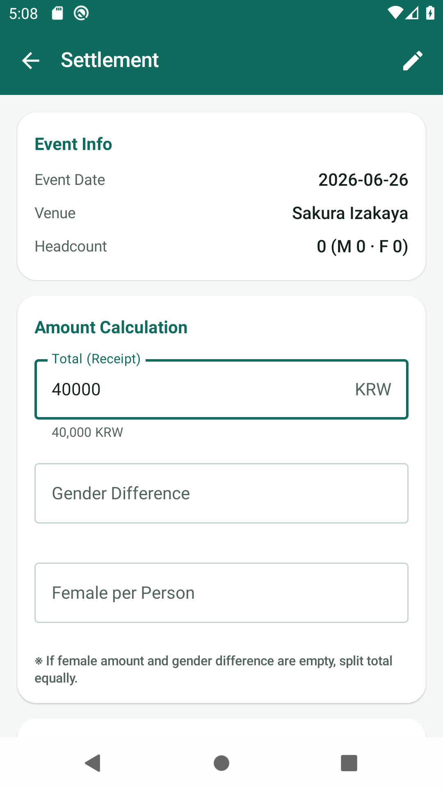
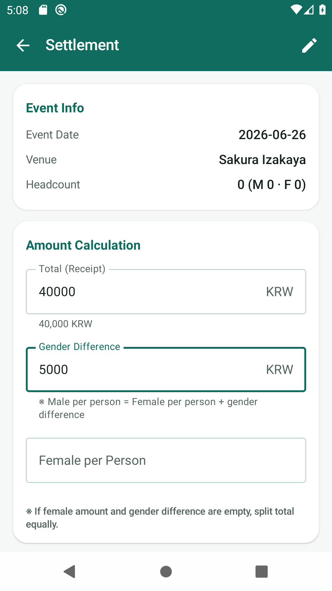
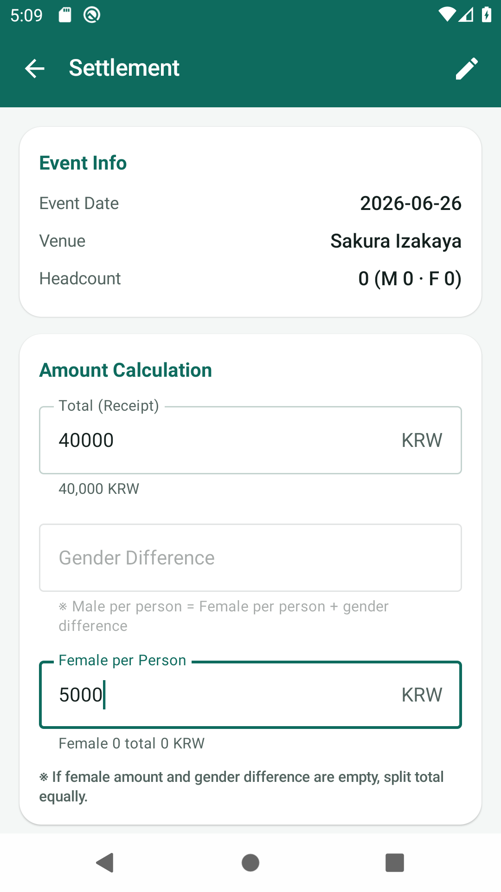
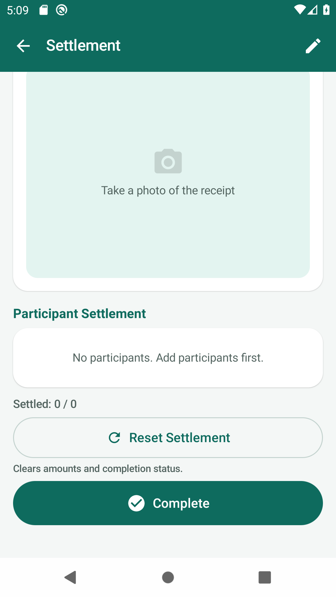
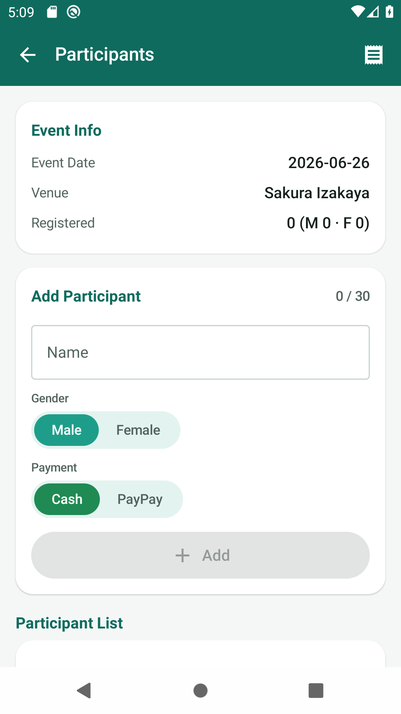
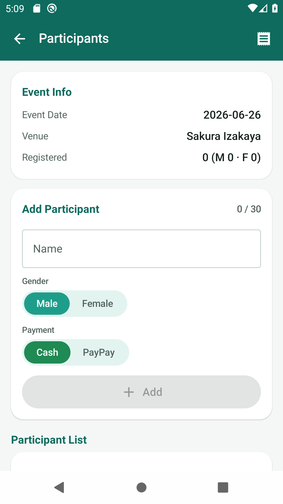

# 정산앱 사용 설명서 (한국어)

> 모임 회비/정산을 간편하게 관리하는 안드로이드 앱입니다.
> **처음 실행 시 휴대폰 시스템 언어**에 맞게 자동 설정되며, 설정에서 **한국어 / 日本語 / English / 中文**을 선택할 수 있습니다.

📖 다른 언어: [日本語](MANUAL_ja.md) · [English](MANUAL_en.md) · [中文](MANUAL_zh.md)

---

## 목차
1. [홈 화면 (메뉴)](#1-홈-화면-메뉴)
2. [모임정보등록](#2-모임정보등록)
3. [참가자등록](#3-참가자등록)
4. [정산](#4-정산)
5. [월별정산일람](#5-월별정산일람)
6. [설정 (언어)](#6-설정-언어)

---

## 1. 홈 화면 (메뉴)

앱을 실행하면 나타나는 첫 화면입니다.
- 상단 **이번 달 정산 합계** · 모임 건수
- 메뉴: 모임정보등록 · 참가자등록 · 정산 · 월별정산일람 · 설정
- **최근 모임** 카드 → 정산 화면, **수정** → 모임 편집

---

## 2. 모임정보등록

- **모임날짜** · **가게이름** · **가게전화번호**
- **참가인원**: 참가자등록에서 이름 추가 시 자동 갱신
- **「등록하고 참가자 추가」** → 저장 후 참가자 화면 이동

---

## 3. 참가자등록

최대 **30명**. **이름** · **성별** · **정산형태(현금/페이페이)** 입력 후 **추가**.

---

## 4. 정산

### 균등 분배 (여자·남여차이 미입력)
| 항목 | 계산식 |
| --- | --- |
| 1인 금액 | 정산금액 ÷ 참가 인원 |

> 40,000원, 4명 → **1인 10,000원**

### 남여차이 금액 입력
| 항목 | 계산식 |
| --- | --- |
| 여자 1인 | (총액 − 차액×남자수) ÷ 총인원 |
| 남자 1인 | 여자 1인 + 차액 |

> 40,000원, 차액 5,000원, 남2·여2 → **여 7,500 / 남 12,500**

### 여자 1인 금액 입력 (남여차이 0으로 초기화)
| 항목 | 계산식 |
| --- | --- |
| 남자 1인 | (총액 − 여자합계) ÷ 남자수 |

### 영수증 · 정산완료 · 초기화

---

## 5. 월별정산일람

---

## 6. 설정 (언어)

- **한국어 / 日本語 / English / 中文** 선택
- 미선택 시 **시스템 언어 자동 적용**
- 앱 이름도 시스템 언어에 맞게 표시 (정산앱 / 精算アプリ / Split Bill / 结算应用)

