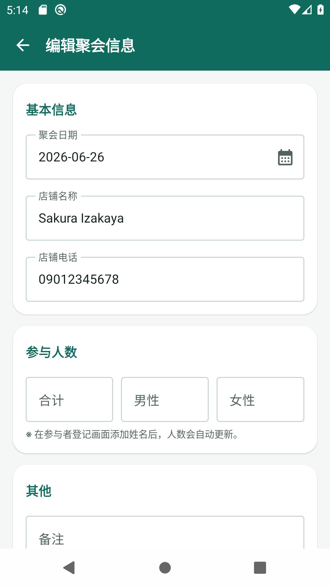
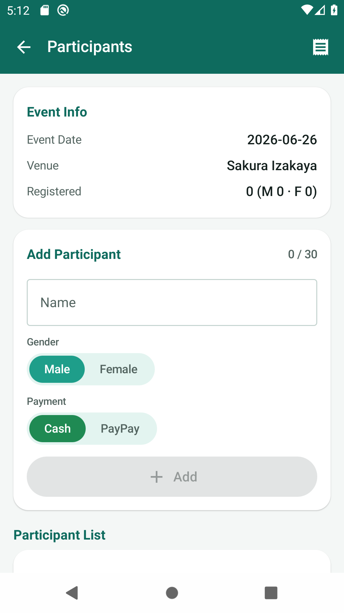
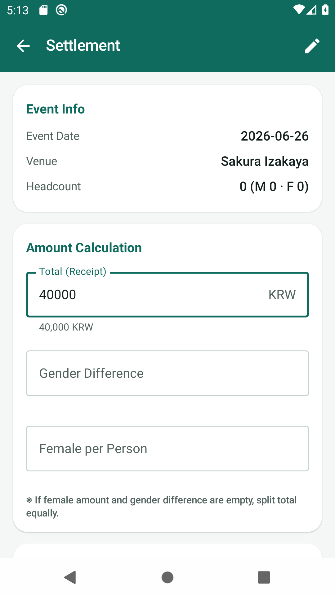
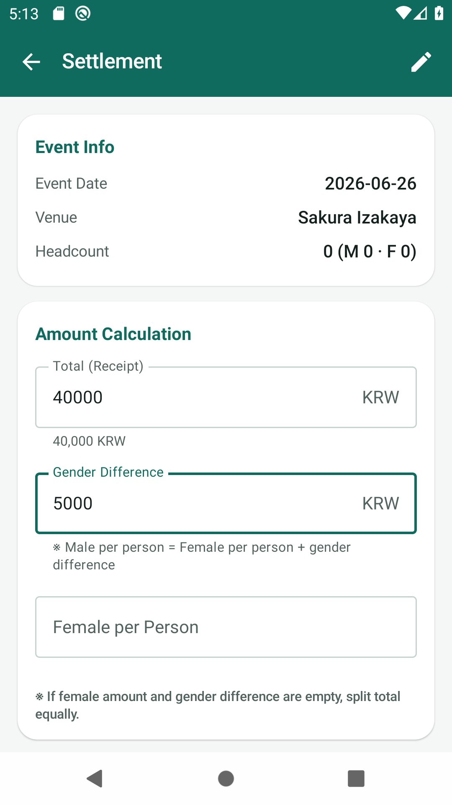
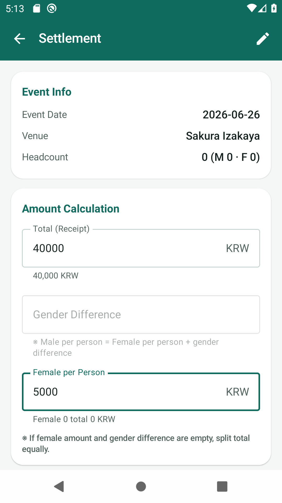
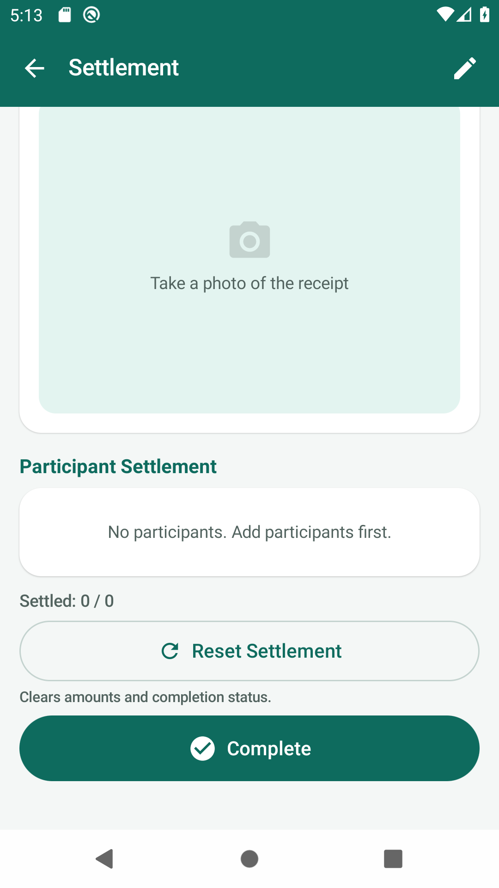
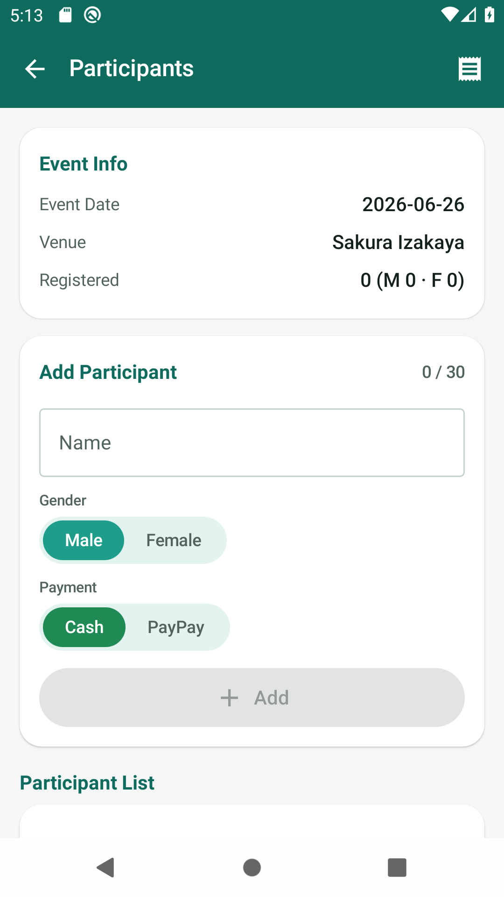
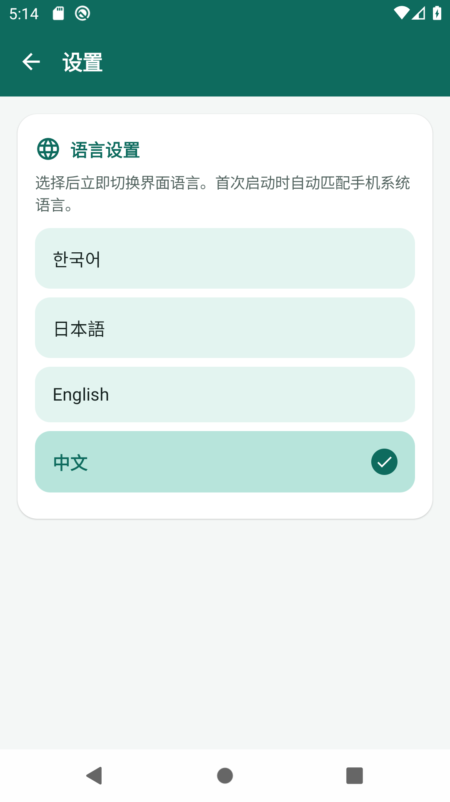

# 结算应用 使用说明 (中文)

> 首次启动时自动匹配**手机系统语言**。可在设置中选择 **한국어 / 日本語 / English / 中文**。

📖 其他语言: [한국어](MANUAL_ko.md) · [日本語](MANUAL_ja.md) · [English](MANUAL_en.md)

---

## 目录
1. [首页](#1-首页)
2. [聚会信息登记](#2-聚会信息登记)
3. [参与者登记](#3-参与者登记)
4. [结算](#4-结算)
5. [月度结算一览](#5-月度结算一览)
6. [设置](#6-设置)

---

## 1. 首页

---

## 2. 聚会信息登记

---

## 3. 参与者登记

---

## 4. 结算

**均分** — 未输入女性金额和男女差额

**男女差额** — 男性 = 女性 + 差额

**女性每人金额** — 男女差额重置为0

**重置 · 完成**

---

## 5. 月度结算一览

---

## 6. 设置

未手动选择时跟随系统语言。应用名称: **结算应用**

